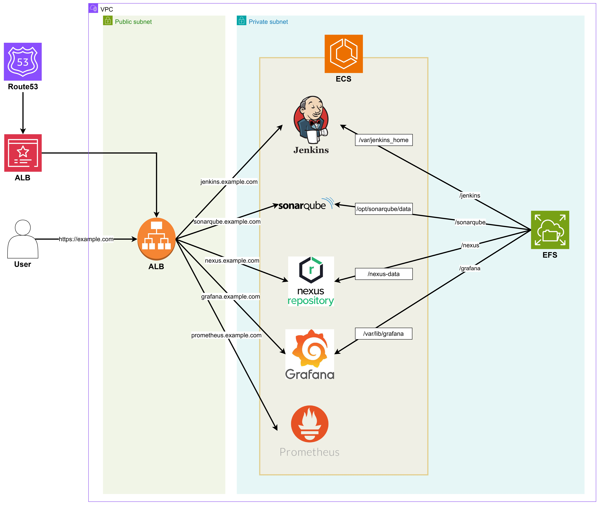

# Terraform DevOps Pipeline



### ⚠️ Essential

1. Prepare an AWS account.
2. Prepare a domain.
    - Prepare your own domain (e.g. example.com).
    - Create a Public Hosting Zone of the domain on Route53.
    - Get a SSL Certificate of you domain (example.com & *.example.com) issued by AWS Certificate Manager (ACM).
3. Prepare an IAM Role for ECS Task Execution with the policies listed below.
    - AmazonECSTaskExecutionRolePolicy
    - AmazonElasticFileSystemClientFullAccess
    - CloudWatchLogsFullAccess
4. Create your own **terraform.tfvars** file on the root directory.

```
domain_name = [your domain name]
ssl_certificate = [ARN of ACM SSL Certificate for your domain name]

jenkins_image = [Jenkins Image URI - ECR Image URI or DockerHub Image URI jenkins/jenkins]
sonarqube_image = [SonarQube Image URI - ECR Image URI or DockerHub Image URI sonarqube]
nexus_image = [Nexus Image URI - ECR Image URI or DockerHub Image URI sonatype/nexus3]
grafana_image = [Grafana Image URI - ECR Image URI or DockerHub Image URI grafana/grafana]
prometheus_image = [Prometheus Image URI - ECR Image URI or DockerHub Image URI bitnami/prometheus]

ecs_task_execution_role_arn = [ARN of IAM Role for ECS Task Execution]
```
### Terraform Execution
```
aws configure 

terraform init
terraform plan
terraform apply
```


### Initial ECS Configuration
If you want, you can adjust the values ​​in /modules/ecs/main.tf.

| Service    | desired_count | cpu  | memory |
|------------|---------------|------|--------|
| Jenkins    | 1             | 2048 | 4096   |
| SonarQube  | 1             | 2048 | 4096   |
| Nexus      | 1             | 2048 | 4096   |
| Grafana    | 1             | 1024 | 2048   |
| Prometheus | 1             | 1024 | 2048   |