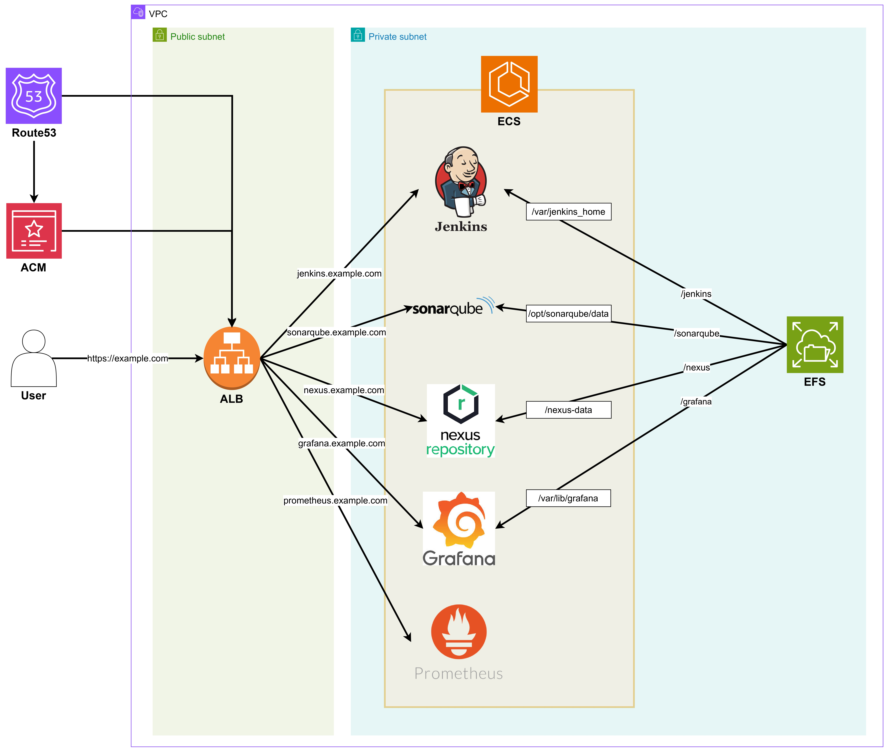

# Terraform DevOps Pipeline Infrastructure



### ⚠️ Essential

1. Prepare an AWS account.
2. Prepare a domain.
    - Prepare your own domain (e.g. example.com).
    - Create a Public Hosting Zone of the domain on Route53.
    - Get a SSL Certificate of you domain (example.com & *.example.com) issued by AWS Certificate Manager (ACM).
3. Prepare an IAM Role for ECS Task Execution with the policies listed below.
    - AmazonECSTaskExecutionRolePolicy
    - AmazonElasticFileSystemClientFullAccess
    - CloudWatchLogsFullAccess
    - AmazonSSMManagedInstanceCore (For getting Nexus initial password)
4. Prepare an IAM Role for EC2 IAM Instance Profile with the policies listed below.
    - AmazonEC2ContainerRegistryPowerUser
    - AmazonEC2ContainerServiceforEC2Role
    - AmazonEC2ContainerServiceRole
    - AmazonEFSCSIDriverPolicy
    - CloudWatchAgentServerPolicy
4. Build a custom Jenkins Docker Image and upload to AWS ECR(Elastic Container Registry). Purpose is to use Docker inside Jenkins for commands like 'docker build'.
```
FROM jenkins/jenkins:lts

USER root
RUN apt-get update && apt-get install -y docker.io awscli

USER jenkins
```
4. Create your own **terraform.tfvars** file on the root directory.

```
domain_name = [your domain name]
ssl_certificate = [ARN of ACM SSL Certificate for your domain name]

jenkins_image = [Jenkins Image URI - ECR Image URI]
sonarqube_image = [SonarQube Image URI - ECR Image URI or DockerHub Image URI sonarqube]
nexus_image = [Nexus Image URI - ECR Image URI or DockerHub Image URI sonatype/nexus3]
grafana_image = [Grafana Image URI - ECR Image URI or DockerHub Image URI grafana/grafana]
prometheus_image = [Prometheus Image URI - ECR Image URI or DockerHub Image URI bitnami/prometheus]

ecs_task_execution_role_arn = [ARN of IAM Role for ECS Task Execution]
iam_instance_profile = [ARN of IAM Role for EC2 IAM Instance Profile]
```
### Terraform Execution
```
aws configure   // log into AWS

terraform init
terraform plan
terraform apply
```


### Initial ECS Configuration
If you want, you can adjust the values ​​in /modules/ecs/main.tf.

| Service    | desired_count | cpu  | memory |
|------------|---------------|------|--------|
| Jenkins    | 1             | 2048 | 4096   |
| SonarQube  | 1             | 2048 | 4096   |
| Nexus      | 1             | 2048 | 4096   |
| Grafana    | 1             | 1024 | 2048   |
| Prometheus | 1             | 1024 | 2048   |

### Jenkins is EC2 type ECS service, and others are Fargate type
To use Docker inside Jenkins for commands like 'Docker build', EC2 type ECS service has been used for Jenkins.
Other services are Fargate (serverless) type ECS service.

### (Optional) Running EFS Backup Manually
```
aws backup start-backup-job --backup-vault-name app-efs-backup --resource-arn arn:aws:elasticfilesystem:us-east-1:088351136602:file-system/fs-068366379ccec1f88 --iam-role-arn arn:aws:iam::088351136602:role/service-role/AWSBackupDefaultServiceRole

aws backup describe-backup-job --backup-job-id [backup job id]  // Check backup status
```

### Getting Nexus initial password
In AWS CLI, 
```
aws ecs execute-command --region us-east-1 --cluster app-cluster --task [Task ARN] --container nexus --command "/bin/sh" --interactive

cat /nexus-data/admin.password
```
